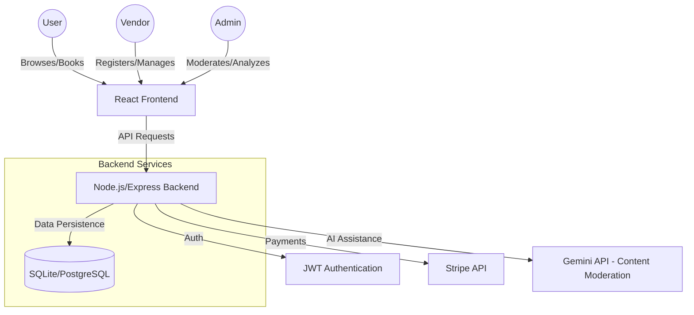

# VivahVandana - System Design & Documentation

## 1. High-Level System Architecture

## 2. User Stories
- **As a User**, I want to search for "Mandap decorators" in "Mumbai" so I can find local services for my wedding.
- **As a User**, I want to view a service's availability calendar so I can book it for my specific wedding date.
- **As a Vendor**, I want to register my catering business and upload photos of my menu so I can attract customers.
- **As an Admin**, I want to review pending vendor applications so I can ensure only high-quality providers are on the platform.

## 3. Database Schema
- **Users**: id, name, email, password_hash, role (USER, VENDOR, ADMIN)
- **Vendors**: id, user_id, business_name, description, location, status (PENDING, APPROVED, REJECTED)
- **Services**: id, vendor_id, category (PANDAL, CATERING, LODGE, etc.), price, images (JSON), description
- **Bookings**: id, user_id, service_id, date, status (PENDING, CONFIRMED, CANCELLED), total_price
- **Reviews**: id, service_id, user_id, rating, comment

## 4. API Endpoints
- `POST /api/auth/register` - User registration
- `POST /api/auth/login` - User login
- `GET /api/services` - List services (with filters)
- `GET /api/services/:id` - Service details
- `POST /api/vendor/register` - Vendor application
- `GET /api/admin/vendors/pending` - Admin: view pending vendors
- `POST /api/admin/vendors/:id/approve` - Admin: approve vendor
- `POST /api/bookings` - Create a booking
- `GET /api/user/bookings` - View my bookings

## 5. Implementation Plan
1. **Phase 1**: Setup Express server with SQLite and basic Auth.
2. **Phase 2**: Implement Vendor registration and Admin approval dashboard.
3. **Phase 3**: Build Service browsing, search, and filtering.
4. **Phase 4**: Implement Booking logic and mock Payment integration.
5. **Phase 5**: UI Polish and Responsive Design.
